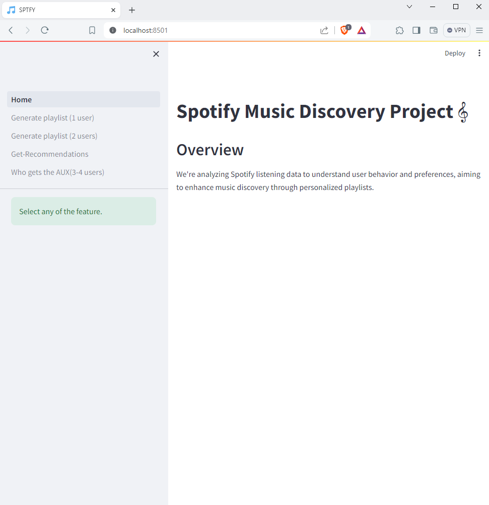

# Spotify Music Discovery - Who gets the AUX?

Spotify has revolutionized the way people listen to music by providing an immense collection of songs, personalized suggestions, and tailored playlists. With millions of users worldwide, Spotify collects a variety of information on listening habits, preferences, and trends. Understanding this data can provide vital insights into user behavior, paving the path for personalized playlist production based on individual preferences.

In this project, we aim to analyze Spotify listening data obtained from Kaggle to design a relational schema and Entity-Relationship (ER) diagram. With the use of data mining techniques, including content-based filtering, we will explore patterns in users' listening behavior and develop algorithms for generating personalized playlists. Our ultimate goal is to provide Spotify users with an enhanced music discovery experience, ensuring that they always have the perfect playlist for any occasion.

### UI Screenshots

#### 1. Dashboard

#### 2. Feature 1 (Generate Playlist - 1 User)

#### 3. Feature 2 (Generate Playlist - 2 User)

#### 4. Feature 3 (Get Recommendation - 1 User)

#### 5. Feature 4 (Who Gets the Aux - 3 User)

## Project Objectives:

- Utilize the following dataset: [Spotify Music Dataset](https://www.kaggle.com/datasets/saurabhshahane/spotgen-music-dataset).
- Utilize Spotify's "Understanding my data" feature for user-specific data.
- Preprocess the data and design an ER diagram for the Spotify dataset, capturing essential entities, attributes, and relationships.
- Design a relational schema based on the ER diagram.
- Implement a Web App with the following functionalities:
  - Generate a playlist based on the user's data.
  - Find similarities between two-three users' data.
  - Get new song recommendations based on the current listening pattern.
  - Generate a playlist based on the multiple users listening activity, utilized for group activities.
- Perform data mining exercises using content-based filtering techniques, such as Cosine similarity and Jaccard similarity, to enhance playlist generation.
- Build a web app using Streamlit and integrate the Spotify Web API using Spotipy for potential web app development.

## Project Overview:

"Who gets the aux?" is the friendly decision-making process during road trips, where passengers take turns choosing the music played in the car. It's a way to ensure everyone gets to hear their favorite songs and enjoy the journey together. With our project, we aim to answer this age-old dilemma by providing Spotify users with playlists that are perfectly tailored to their tastes, ensuring that everyone gets their moment to shine behind the wheel.

### ER Diagram

### Use Case Diagram

## Dataset:

The dataset for this project is sourced from Kaggle and includes Spotify listening data. It contains valuable insights into user preferences, favorite genres, artists, and more.

## Technologies Used:

- Python for data analysis and algorithm implementation
- SQL for designing the relational schema
- CLI (Command Line Interface) for user interaction
- Streamlit for building the web app
- Spotipy for integrating the Spotify Web API
- Spotify Web API for potential web app development

**Note**: This project is for educational and research purposes only. All data obtained from Spotify is anonymized and used in compliance with their terms of service and privacy policy.
